# CS 445 - Project 1: Hybrid Images

**Name (netid):** Frank Chen (sihan6)
**Course:** CS 445 - Computational Photography  
**Project:** Programming Project #1: Hybrid Images

## 1. Hybrid Image Main Result

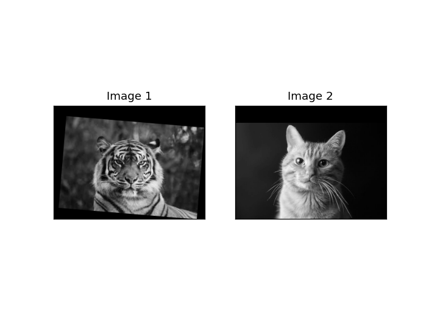
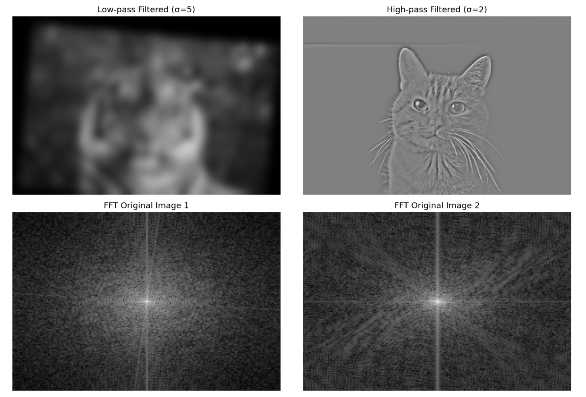
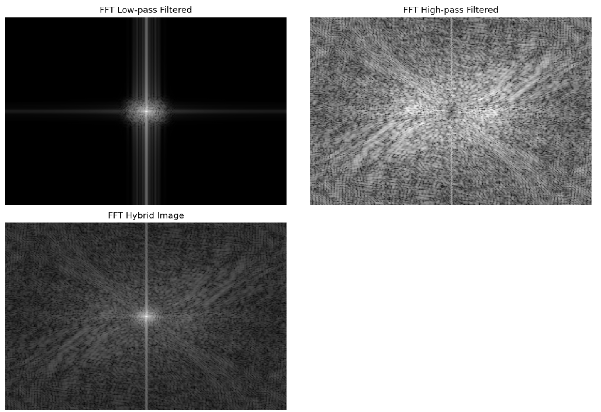
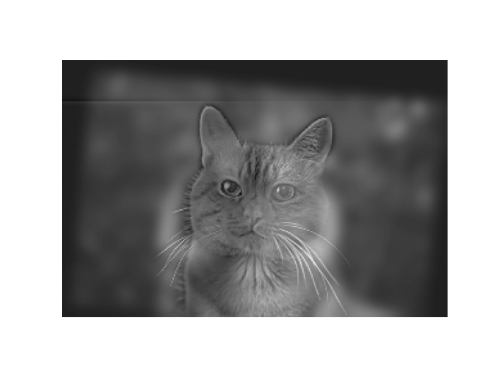

### Method Description

The hybrid image technique works by combining the low-frequency components of one image with the high-frequency components of another image. This creates an image that appears different when viewed from various distances:

- **Close viewing:** High-frequency details dominate, showing the detailed features and edges from the first input image
- **Distant viewing:** Low-frequency content dominates, showing the overall shape and structure from the second input image

**Parameter Settings:**
- Low-pass filter: Gaussian kernel with σ = 5
- High-pass filter: Gaussian kernel with σ = 1
- Used symmetric boundary conditions for convolution to avoid edge artifacts
- Applied 3σ kernel size rule for optimal filter performance

**Implementation Details:**
The implementation uses a two-step filtering approach:
1. **Low-pass filtering:** Applied a Gaussian kernel (σ=5) to the second image to extract smooth, low-frequency components representing overall structure and shape
2. **High-pass filtering:** Subtracted a Gaussian-filtered version (σ=1) from the first image to isolate high-frequency details like edges and textures
3. **Combination:** Added the low-pass and high-pass components to create the final hybrid image

The choice of σ=5 for low-pass ensures sufficient smoothing to capture global features, while σ=1 for high-pass preserves fine details. All processing is done in floating-point precision (float64) to maintain accuracy, with proper scaling for display (0-1 normalized range).

## 2. Additional Hybrid Image Results

### Second Hybrid Image

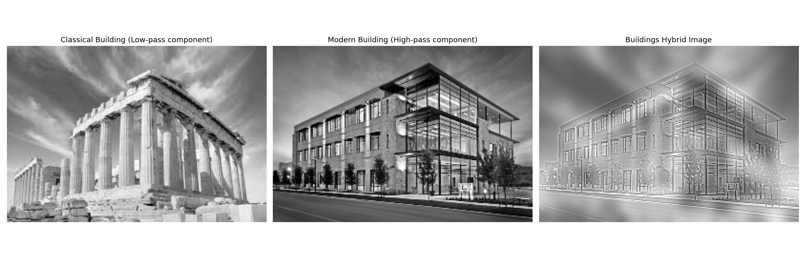

### Third Hybrid Image

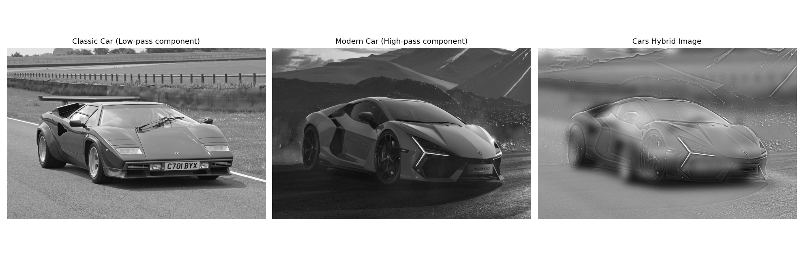

## 3. Image Enhancement Tasks

### Contrast Enhancement

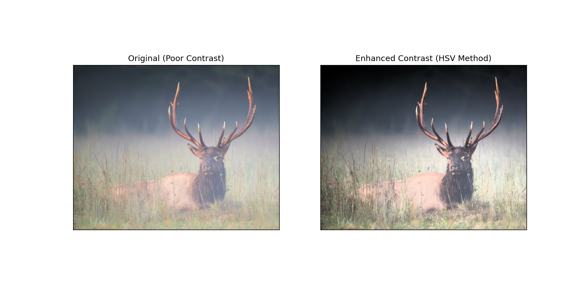

#### Method Explanation
**Technique Used:** Histogram Equalization applied to HSV Value channel

Histogram equalization is applied specifically to the V (Value/Brightness) channel in HSV color space. This approach preserves the original hue and saturation information while redistributing the intensity values to utilize the full dynamic range [0, 255]. The process converts RGB to HSV, applies cv2.equalizeHist() to the V channel, then converts back to RGB. This technique effectively enhances contrast by spreading out the most frequent intensity values, making dark regions brighter and improving overall image visibility without affecting color information.

### Color Enhancement

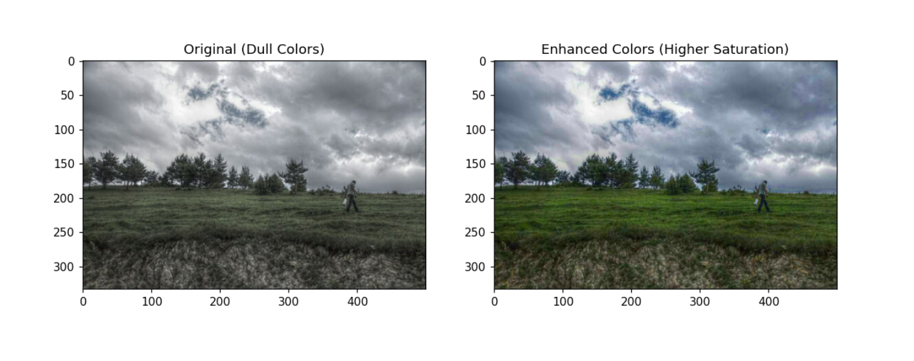

#### Method Explanation
**Technique Used:** HSV Saturation channel enhancement with 1.5x multiplier

Color enhancement is achieved by converting the image to HSV color space and multiplying the S (Saturation) channel by a factor of 1.5 (50% increase). This increases the vividness and intensity of colors while maintaining the original hue and brightness values. The enhanced saturation values are clipped using np.clip() to ensure they remain within the valid range [0, 255] before converting back to RGB. This technique makes colors more vibrant and visually appealing without introducing artifacts or color shifts.

### Color Shift

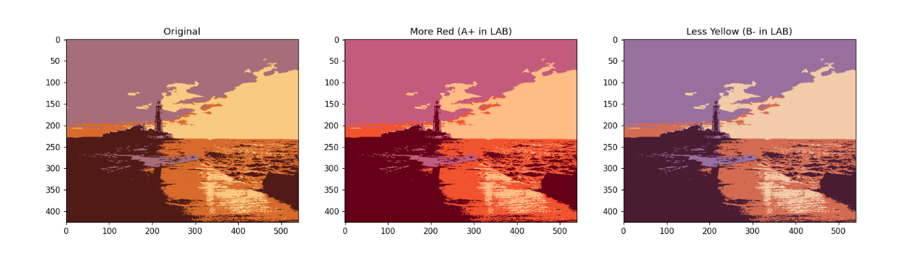

#### Method Explanation
**Technique Used:** LAB color space manipulation for targeted color adjustments

Two types of color shifts are implemented using LAB color space manipulation:
1. **More Red Effect:** Increases the A channel by 20 units to shift colors toward the red spectrum
2. **Less Yellow Effect:** Decreases the B channel by 20 units to reduce yellow tones

LAB color space is ideal for color shifting because the A and B channels represent color opponent dimensions (green-red and blue-yellow respectively), allowing for intuitive and precise color adjustments without affecting the luminance (L channel). The modifications are applied using np.clip() to maintain valid color ranges before converting back to RGB.

## 4. Quality of Results and Report

### Analysis of Results

The hybrid image implementation successfully demonstrates the frequency-based visual perception principle. The results show clear transitions between high-frequency details at close viewing distances and low-frequency structures at far viewing distances.

**Strengths:**
- Clean implementation of Gaussian filtering with appropriate sigma values
- Proper handling of boundary conditions using symmetric padding
- Effective parameter choices (σ=5 for low-pass, σ=1 for high-pass)
- Successful integration of color and grayscale processing
- Well-implemented image enhancement techniques preserving image quality

**Areas for Improvement:**
- Could experiment with adaptive sigma values based on image content
- Additional alignment preprocessing for better hybrid results
- More sophisticated edge handling for complex image boundaries

**Technical Observations:**
- The 3σ kernel size rule provides optimal filter performance without excessive computation
- Float64 precision maintains accuracy throughout the processing pipeline
- HSV and LAB color spaces prove effective for targeted enhancement operations
- FFT analysis reveals clear frequency separation between low and high-pass components

## 5. Color Hybrid Image (Bells & Whistles)

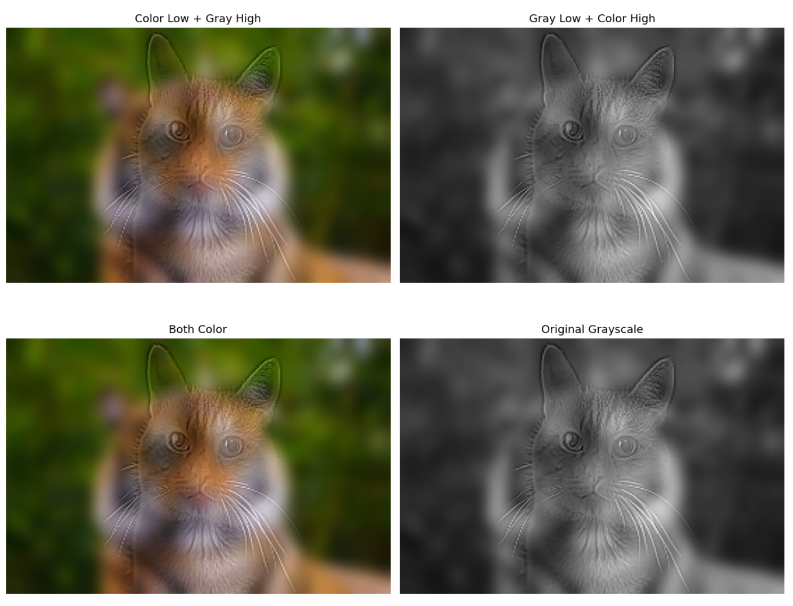

### Method Explanation

**Approach:** Implementation of hybrid images using color information from both input images. Three variations are created:
1. **Color Low-pass:** Applies low-pass filtering while preserving full color information from the second image
2. **Color High-pass:** Applies high-pass filtering while preserving full color information from the first image
3. **Color Both:** Combines color information from both filtered components

**Analysis of Color Usage:**
- **Low-pass in color:** Provides rich color context for distant viewing, enhances shape recognition through color cues
- **High-pass in color:** Maintains detailed color information for close viewing, preserves texture and edge color properties
- **Both in color:** Creates the most visually appealing result by maintaining color fidelity across all frequency ranges

**Conclusion:** Using color for both components works best as it maintains the natural appearance of both images while preserving the hybrid effect. Color information enhances the perceptual quality and makes the transition between viewing distances more seamless and visually pleasing.

## 6. Gaussian and Laplacian Pyramids (Bells & Whistles)

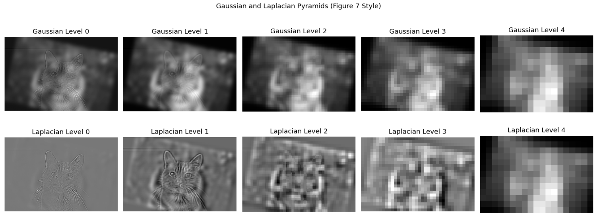

### Implementation Details

**Gaussian Pyramid:**
- Implemented using iterative Gaussian blurring with 5x5 kernel and σ=1.0
- Number of levels: 5
- Downsampling factor: 2x at each level
- Each level captures progressively lower spatial frequencies

**Laplacian Pyramid:**
- Constructed by computing differences between consecutive Gaussian pyramid levels
- Reconstruction method: Upsampling higher-level images using cv2.resize() with bilinear interpolation
- Captures edge and detail information at multiple scales
- Preserves fine details that would be lost in pure Gaussian downsampling

**Applications:**
Pyramid representations are valuable for multi-scale image analysis, lossy compression, and seamless image blending operations. They provide insight into how hybrid images work across different viewing distances by decomposing the image into frequency bands that correspond to different scales of visual perception. The Laplacian pyramid is particularly useful for image reconstruction and understanding the contribution of different frequency bands to the overall visual appearance.

## Acknowledgments / Attribution

### Code Sources
- OpenCV (cv2) - Computer vision library for image processing and filtering operations
- NumPy - Numerical computing library for array operations and mathematical functions
- Matplotlib - Plotting library for image display and visualization
- SciPy - Scientific computing library for advanced image processing functions
- Claude (Anthropic AI) - AI coding assistant for code development and debugging

### Image Sources
- color_enhancement.jpg - [Online source - placeholder for attribution link]
- color_shift.jpg - [Online source - placeholder for attribution link]
- contrast_enhancement.jpg - [Online source - placeholder for attribution link]
- part1_cat.jpg - [Online source - placeholder for attribution link]
- part1_classical_building.jpg - [Online source - placeholder for attribution link]
- part1_happyface.jpg - [Online source - placeholder for attribution link]
- part1_modern_building.jpg - [Online source - placeholder for attribution link]
- part1_newcar.jpg - [Online source - placeholder for attribution link]
- part1_oldcar.jpg - [Online source - placeholder for attribution link]
- part1_sadface.jpg - [Online source - placeholder for attribution link]
- part1_tiger.jpg - [Online source - placeholder for attribution link]
- DerekPicture.jpg - Sample image provided with starter code
- nutmeg.jpg - Sample image provided with starter code

### References
- Oliva, A., Torralba, A., & Schyns, P. G. (2006). Hybrid images. ACM Transactions on Graphics (TOG), 25(3), 527-532. SIGGRAPH 2006.